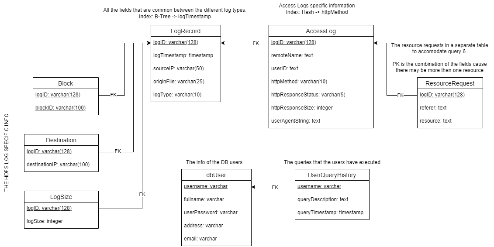

# Log Management System - DBMS Project 1

This is the first project for the MSc course  __Database Management System (M149)__ of the winter semester. The pronunciation can be found in the _M149-Project01.pdf_.

## 🛠️ Backend - FastAPI
Inside the _backend/_ directory:

Activate virtual environment:
```bash
$ source venv/Scripts/activate
```

Install requirements:
```bash
$ pip install -r requirements.txt
```

To start backend server:
```bash
$ uvicorn main:app --reload
```

To connect to your database, create an `.env` file with the properties of your database, like this:
```bash
export DB_HOST=<host> (probably, localhost)
export DB_PORT=<port> (probably, 5432)
export DB_USERNAME=<username>
export DB_PASSWORD=<password>
export DB_NAME=LogDB
```

## 🎨 Frontend - React 
[Chakra UI](https://chakra-ui.com/) was used as the component library

In the _frontend/_ directory:

To run the app in development mode:
```bash
$ npm run start
```

Open [http://localhost:3000](http://localhost:3000) to view it in your browser.


## 🗄️ Database - Postgresql
Inside the _/database_ directory:

Almost all the SQL queries are included.

> ⚠️ Make sure to first execute the stored functions in the database before running the web application

The EntityRelation diagram is provided, accompanied with comments.

